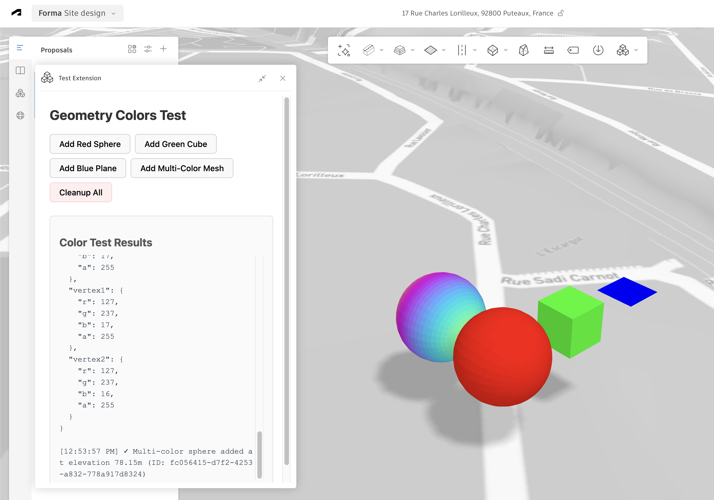

# Geometry Colors Test - Forma Extension POC

## Overview



This is a proof-of-concept Autodesk Forma extension that demonstrates how to add colored meshes to the 3D scene using the Forma Embedded View SDK. The extension showcases vertex color rendering with various geometric shapes and color configurations.

## Project Structure

```
extension-geometry-colors-test/
├── manifest.json          # Extension manifest for Forma
├── index.html            # Extension UI
├── src/
│   ├── main.ts          # Main extension logic
│   ├── geometry-simple.ts      # Mesh generation utilities
│   └── style.css        # UI styles
├── package.json
└── tsconfig.json
```

## Features

This extension demonstrates four different colored meshes:

1. **Red Sphere** (RGB 255,0,0) - Smooth sphere with solid red color
2. **Green Cube** (RGB 0,255,0) - Cube with solid green color
3. **Blue Plane** (RGB 0,0,255) - Flat plane with solid blue color
4. **Multi-Color Sphere** - Sphere with gradient vertex colors

All meshes are positioned above the terrain surface using the Terrain API.

## Setup Instructions

### Prerequisites

- Node.js 16 or higher
- npm or pnpm
- Access to Autodesk Forma

### Installation

1. Clone or download this repository

2. Install dependencies:
   ```bash
   npm install
   ```

3. Start the development server:
   ```bash
   npm run dev
   ```
   The extension will be available at `http://localhost:5173`

### Loading in Forma

1. Open Autodesk Forma in your browser
2. Navigate to a project/proposal
3. Add this extension using the manifest URL:
   - Development: Point to `http://localhost:5173/manifest.json`
   - Or use Forma's extension loading interface

## Usage

Once loaded in Forma:

1. Click **"Add Red Sphere"** to create a red sphere
2. Click **"Add Green Cube"** to create a green cube
3. Click **"Add Blue Plane"** to create a blue plane
4. Click **"Add Multi-Color Mesh"** to create a sphere with gradient colors
5. Click **"Cleanup All"** to remove all added meshes

The log panel shows:
- Terrain elevation at the origin
- Vertex counts for each mesh
- Sample color values
- Mesh IDs and elevation heights
- Any errors encountered

## Technical Details

### Color Format

The extension uses `Uint8Array` for vertex colors with RGBA format:
- Each vertex has 4 bytes: `[R, G, B, A]`
- Values range from 0-255
- Alpha is set to 255 (fully opaque)

```typescript
function makeVertexColors(vertexCount: number, r: number, g: number, b: number, alpha: number = 1): Uint8Array {
  const colors = new Uint8Array(vertexCount * 4);
  for (let i = 0; i < vertexCount; i++) {
    colors[i * 4 + 0] = r;     // Red
    colors[i * 4 + 1] = g;     // Green
    colors[i * 4 + 2] = b;     // Blue
    colors[i * 4 + 3] = Math.floor(alpha * 255); // Alpha
  }
  return colors;
}
```

### Transform Matrix

Forma uses 4x4 transformation matrices (column-major order) with translation in meters:
```typescript
const transform: [number, ...] = [
  1, 0, 0, 0,  // Column 1 (X-axis)
  0, 1, 0, 0,  // Column 2 (Y-axis)
  0, 0, 1, 0,  // Column 3 (Z-axis)
  x, y, z, 1   // Column 4 (translation in meters)
];
```

### Geometry Data Structure

The extension uses triangle soup (non-indexed geometry) for reliable rendering:
```typescript
{
  position: Float32Array,  // Each triangle = 9 floats (3 vertices × 3 coords)
  color: Uint8Array        // RGBA colors per vertex
}
```

### Terrain-Aware Positioning

Meshes are positioned relative to the actual terrain elevation:
```typescript
const elevation = await Forma.terrain.getElevationAt({ x: 0, y: 0 });
const height = elevation + 10; // 10 meters above terrain
```

## Key Implementation Notes

1. **Use triangle soup instead of indexed geometry** for reliable mesh rendering
2. **Get terrain elevation** before positioning meshes to ensure they appear above ground
3. **Column-major transform matrices** with translation values in the last column
4. **Z-axis is vertical** (up direction) in the Forma coordinate system
5. **All coordinates are in meters**

## Building for Production

```bash
npm run build
```

This creates a `dist/` folder with the compiled extension. Update the manifest URL to point to your production server.

## References

- [Forma Embedded View SDK Docs](https://app.autodeskforma.com/forma-embedded-view-sdk/docs/)
- [Forma API Tutorial](https://aps.autodesk.com/en/docs/forma/v1/embedded-views/tutorial/)
- [RenderApi Interface](https://app.autodeskforma.com/forma-embedded-view-sdk/docs/interfaces/render.RenderApi.html)
- [TerrainApi Interface](https://app.autodeskforma.com/forma-embedded-view-sdk/docs/interfaces/terrain.TerrainApi.html)

## License

This is a proof-of-concept demonstration project.

## Support

For questions about Forma extensions:
- [Forma Developer Forum](https://forums.autodesk.com/t5/forma-developer-forum/bd-p/forma-developer-forum-en)
- [Forma API Documentation](https://aps.autodesk.com/en/docs/forma/v1/)
